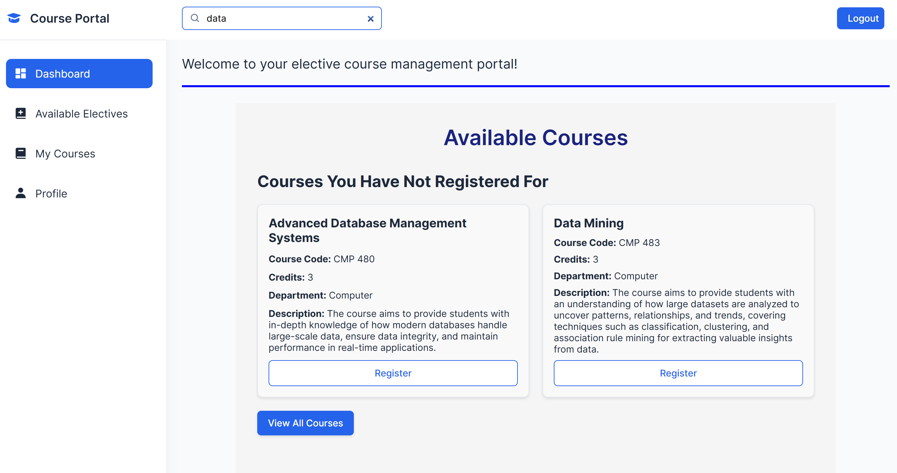

# Elective Course Registration System

This is an **Elective Course Registration System** designed for managing course registration for students in a university. It allows students to view available courses, register for elective courses, and manage their registration details.

## Features

- **Student Registration**: Students can register for available elective courses.
- **Course Management**: Students can view the list of courses they have registered for.
- **Course Search**: Search and filter available courses based on department, credits, and other criteria.
- **Course Drop**: Students can drop courses they have already registered for.
- **Real-Time Updates**: The system provides real-time updates on course availability and registration status.
- **Easy-to-Use Interface**: A user-friendly web interface for students to interact with the system.

## Tech Stack

- **Frontend**: HTML, CSS, JavaScript (for interactivity)
- **Backend**: FastAPI (Python-based web framework)
- **Database**: MySQL (XAMPP with SQLAlchemy for database integration)
- **Authentication**: JWT-based authentication for secure access
- **ORM**: SQLAlchemy for database handling

## Setup and Installation

### Prerequisites

- Python 3.8+ 
- MySQL Server (XAMPP recommended)
- FastAPI
- SQLAlchemy
- Pydantic
- Jinja2 for HTML rendering

### Steps to Run

1. **Clone this repository**:
   ```bash
   git clone <repository-url>
2. **Install required dependencies**:
    ```bash
    pip install -r requirements.txt
3. **Run the FastAPI application**:
    ```bash
    python -m uvicorn main:app --reload


## Project Screenshots

### Landing Page


### Login Page


### Student Dashboard


### Search Courses




### Course Registration


### Drop Courses


### Admin Dashboard


